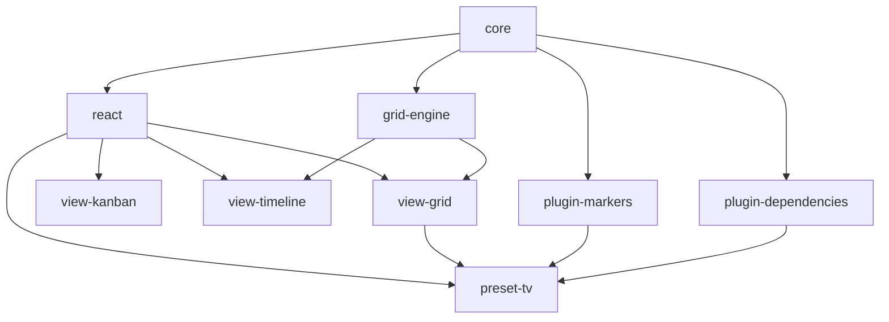

# Design Document: Kairos Modular Scheduler

## Overview

Kairos transforms the existing shadcn-scheduler from a monolithic React component library into a modular, tree-shakeable monorepo architecture. The design separates core scheduling logic from presentation layers, enabling developers to import only the components they need while maintaining a consistent scheduling engine across all view types.

The architecture follows a strict separation of concerns:
- **Core Engine**: UI-agnostic scheduling logic with zero React dependencies
- **React Shell**: Minimal React wrapper providing context and state management
- **View Plugins**: Independent, tree-shakeable view components (Grid, Kanban, Timeline, etc.)
- **Plugin System**: Slot-based rendering system for extensible functionality
- **Preset Packages**: Pre-configured bundles for specific use cases

## Architecture

### Monorepo Structure

```
kairos/
├── packages/
│   ├── core/                    # @kairos/core - headless engine
│   ├── react/                   # @kairos/react - SchedulerShell + context
│   ├── grid-engine/             # @kairos/grid-engine - shared grid logic
│   ├── views/
│   │   ├── grid/               # @kairos/view-grid
│   │   ├── kanban/             # @kairos/view-kanban
│   │   ├── timeline/           # @kairos/view-timeline
│   │   ├── month/              # @kairos/view-month
│   │   └── list/               # @kairos/view-list
│   ├── plugins/
│   │   ├── markers/            # @kairos/plugin-markers
│   │   ├── dependencies/       # @kairos/plugin-dependencies
│   │   ├── histogram/          # @kairos/plugin-histogram
│   │   └── availability/       # @kairos/plugin-availability
│   ├── presets/
│   │   ├── tv/                 # @kairos/preset-tv
│   │   ├── healthcare/         # @kairos/preset-healthcare
│   │   └── gantt/              # @kairos/preset-gantt
│   └── scheduler/              # @kairos/scheduler - full bundle
└── apps/
    └── docs/                   # Documentation site
```

### Package Dependencies



### Core Engine Architecture

The core engine operates as a pure JavaScript library with no React dependencies:

```typescript
// @kairos/core architecture
export interface KairosEngine {
  // Data normalization
  parseBlocks(data: unknown[]): Block[]
  parseResources(data: unknown[]): Resource[]
  
  // Layout computation
  computeGridLayout(blocks: Block[], config: GridConfig): GridLayout
  computeKanbanLayout(blocks: Block[], config: KanbanConfig): KanbanLayout
  
  // State management
  createReducer(): SchedulerReducer
  
  // Drag operations
  createDragEngine(options: DragEngineOptions): DragEngine
}
```

## Components and Interfaces

### Core Package (@kairos/core)

**Purpose**: UI-agnostic scheduling engine containing all business logic.

**Key Interfaces**:

```typescript
// Core data models
export interface Block {
  id: string
  startH: number
  endH: number
  date: string
  categoryId: string
  title: string
  draggable?: boolean
  resizable?: boolean
  metadata?: Record<string, unknown>
}

export interface Resource {
  id: string
  name: string
  type: 'category' | 'employee'
  parentId?: string
  metadata?: Record<string, unknown>
}

// Layout strategies
export interface LayoutStrategy<TConfig, TLayout> {
  compute(blocks: Block[], resources: Resource[], config: TConfig): TLayout
}

export interface GridLayout {
  rows: LayoutRow[]
  columns: LayoutColumn[]
  blocks: PositionedBlock[]
}

export interface KanbanLayout {
  columns: KanbanColumn[]
  items: KanbanItem[]
}

// State management
export interface SchedulerState {
  blocks: Block[]
  resources: Resource[]
  view: ViewType
  selection: string[]
  dragState: DragState | null
}

export type SchedulerAction = 
  | { type: 'MOVE_BLOCK'; payload: { id: string; startH: number; endH: number; categoryId: string; date: string } }
  | { type: 'RESIZE_BLOCK'; payload: { id: string; startH: number; endH: number } }
  | { type: 'CREATE_BLOCK'; payload: Block }
  | { type: 'DELETE_BLOCK'; payload: { id: string } }
  | { type: 'SET_VIEW'; payload: { view: ViewType } }
  | { type: 'UNDO' }
  | { type: 'REDO' }

// Plugin system
export interface KairosPlugin {
  name: string
  version: string
  slots: Record<SlotName, SlotRenderer>
}

export type SlotName = 
  | 'grid-overlay'
  | 'grid-background'
  | 'block-content'
  | 'sidebar-top'
  | 'sidebar-bottom'
  | 'header-actions'

export interface SlotContext {
  blocks: Block[]
  resources: Resource[]
  layout: unknown
  state: SchedulerState
}
```

### React Package (@kairos/react)

**Purpose**: Minimal React wrapper providing context and state management.

```typescript
// SchedulerShell - replaces the monolithic Scheduler component
export interface SchedulerShellProps {
  blocks: Block[]
  resources: Resource[]
  view: ViewType
  onBlocksChange: (blocks: Block[]) => void
  plugins?: KairosPlugin[]
  children: React.ReactNode
}

export function SchedulerShell(props: SchedulerShellProps): React.ReactElement

// Context for view components
export interface SchedulerContextValue {
  state: SchedulerState
  dispatch: React.Dispatch<SchedulerAction>
  engine: KairosEngine
  plugins: KairosPlugin[]
}

export const SchedulerContext: React.Context<SchedulerContextValue>
export function useSchedulerContext(): SchedulerContextValue
```

### Grid Engine Package (@kairos/grid-engine)

**Purpose**: Shared grid rendering logic used by Day, Week, and Timeline views.

```typescript
export interface GridViewProps {
  variant: 'day' | 'week' | 'timeline'
  timeScale: 'hour' | 'day'
  showSidebar?: boolean
  virtualizeRows?: boolean
  virtualizeColumns?: boolean
}

export function GridView(props: GridViewProps): React.ReactElement

// Virtualization integration
export interface VirtualGridConfig {
  rowHeight: number | ((index: number) => number)
  columnWidth: number | ((index: number) => number)
  overscan: number
}
```

### View Plugin Architecture

Each view plugin is completely independent and tree-shakeable:

```typescript
// @kairos/view-grid
export function GridView(): React.ReactElement {
  const { state, dispatch, engine } = useSchedulerContext()
  const layout = useMemo(() => 
    engine.computeGridLayout(state.blocks, gridConfig), 
    [state.blocks, engine]
  )
  
  // Uses @tanstack/react-virtual for performance
  const virtualizer = useVirtualizer({
    count: layout.rows.length,
    getScrollElement: () => scrollRef.current,
    estimateSize: (index) => layout.rows[index].height,
  })
  
  return (
    <div ref={scrollRef}>
      {virtualizer.getVirtualItems().map(virtualRow => (
        <GridRow key={virtualRow.key} row={layout.rows[virtualRow.index]} />
      ))}
    </div>
  )
}

// @kairos/view-kanban
export function KanbanView(): React.ReactElement {
  const { state, engine } = useSchedulerContext()
  const layout = useMemo(() => 
    engine.computeKanbanLayout(state.blocks, kanbanConfig),
    [state.blocks, engine]
  )
  
  return (
    <div className="kanban-board">
      {layout.columns.map(column => (
        <KanbanColumn key={column.id} column={column} />
      ))}
    </div>
  )
}
```

## Data Models

### Block Model

```typescript
export interface Block {
  // Core scheduling properties
  id: string
  startH: number        // Start hour (0-24)
  endH: number         // End hour (0-24)
  date: string         // ISO date string
  categoryId: string   // Resource assignment
  
  // Display properties
  title: string
  description?: string
  color?: string
  
  // Interaction properties
  draggable?: boolean
  resizable?: boolean
  selectable?: boolean
  
  // Extensibility
  metadata?: Record<string, unknown>
}
```

### Resource Model

```typescript
export interface Resource {
  id: string
  name: string
  type: 'category' | 'employee' | 'room' | 'equipment'
  parentId?: string    // For hierarchical resources
  
  // Display properties
  color?: string
  avatar?: string
  
  // Scheduling properties
  availability?: TimeRange[]
  capacity?: number
  
  // Extensibility
  metadata?: Record<string, unknown>
}
```

### Layout Models

```typescript
export interface GridLayout {
  rows: LayoutRow[]
  columns: LayoutColumn[]
  blocks: PositionedBlock[]
  config: GridConfig
}

export interface LayoutRow {
  id: string
  resourceId: string
  top: number
  height: number
  level: number        // For hierarchical resources
}

export interface LayoutColumn {
  id: string
  date: string
  hour?: number
  left: number
  width: number
}

export interface PositionedBlock {
  block: Block
  left: number
  top: number
  width: number
  height: number
  zIndex: number
  overlapIndex: number
}
```

## Correctness Properties

*A property is a characteristic or behavior that should hold true across all valid executions of a system-essentially, a formal statement about what the system should do. Properties serve as the bridge between human-readable specifications and machine-verifiable correctness guarantees.*
