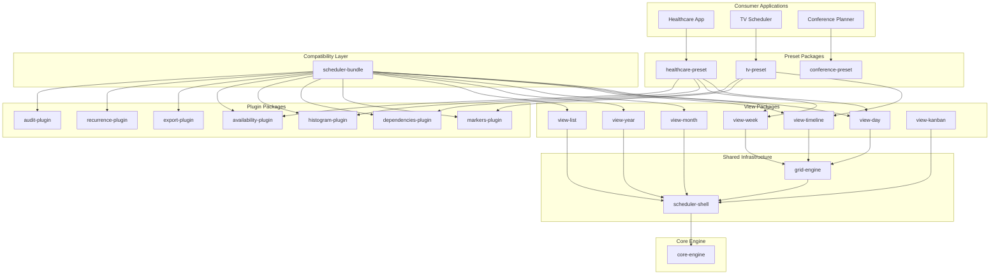
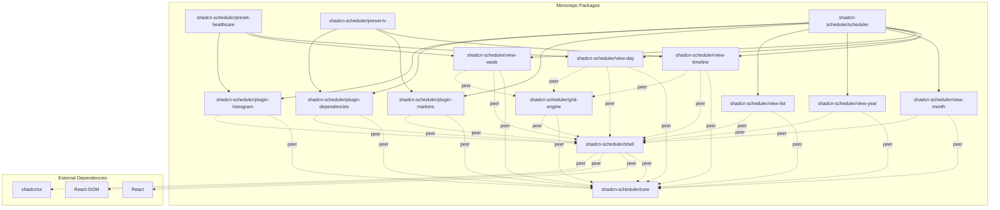

# Design Document: Scheduler Monorepo Refactor

## Overview

This design outlines the technical approach for refactoring the shadcn-scheduler library from a monolithic package into a modular monorepo architecture. The current library bundles all views, plugins, and domain-specific configurations into a single package, resulting in large bundle sizes for consumers who only need specific functionality.

The refactor will decompose the existing 4,873-line GridView component and related functionality into:
- A headless core engine with zero React dependencies
- Individual view packages (day, week, timeline, month, year, list, kanban)
- Optional plugin packages (markers, dependencies, histogram, availability, export, recurrence, audit)
- Domain-specific preset packages (healthcare, TV scheduling, conference, etc.)
- A backward-compatible bundle for seamless migration

This modular approach enables tree-shaking, allowing consumers to bundle only the components they use, potentially reducing bundle sizes by 60% or more for single-view applications.

## Architecture

### High-Level Architecture



### Package Dependency Graph



## Components and Interfaces

### Core Engine Package (`shadcn-scheduler/core`)

The headless computation engine containing pure functions with zero React dependencies.

**Key Modules:**
- `layout/geometry.ts` - Grid calculations, cell positioning, drag operations
- `layout/dragEngine.ts` - Drag and drop logic, conflict detection
- `utils/packing.ts` - Shift packing algorithms, conflict resolution
- `utils/recurrence.ts` - Recurrence rule expansion
- `utils/timezone.ts` - Date/time calculations
- `constants.ts` - Shared constants and configuration
- `types.ts` - Core type definitions

**Public API:**
```typescript
// Pure functions for layout calculations
export function calculateGridGeometry(config: GridConfig): GridGeometry
export function calculateCellPosition(date: Date, resource: Resource): CellPosition
export function detectConflicts(blocks: Block[]): ConflictMap
export function expandRecurrence(rule: RecurrenceRule, dateRange: DateRange): Date[]

// Date/time utilities
export function snapToInterval(date: Date, intervalMinutes: number): Date
export function getWeekDates(startDate: Date): Date[]
export function isWithinWorkingHours(date: Date, workingHours: WorkingHours): boolean

// Packing algorithms
export function packShifts(blocks: Block[], resources: Resource[]): PackedLayout
export function findOptimalPlacement(block: Block, constraints: Constraint[]): Position
```

### Scheduler Shell Package (`shadcn-scheduler/shell`)

React wrapper providing context, state management, and plugin coordination.

**Key Components:**
- `SchedulerProvider` - Context provider for shared state
- `SchedulerShell` - Main container component
- `PluginManager` - Plugin registration and lifecycle management
- `SlotRenderer` - Plugin slot rendering system

**Public API:**
```typescript
export interface SchedulerProviderProps {
  categories: Resource[]
  employees: Resource[]
  config?: SchedulerConfig
  plugins?: Plugin[]
  children: React.ReactNode
}

export interface SchedulerShellProps {
  shifts: Block[]
  onShiftsChange: (shifts: Block[]) => void
  view: React.ComponentType<ViewProps>
  headerActions?: React.ReactNode
  settings?: React.ComponentType<SettingsProps>
}

export interface Plugin {
  id: string
  name: string
  version: string
  slots: Record<string, React.ComponentType>
  lifecycle?: PluginLifecycle
}
```

### Grid Engine Package (`shadcn-scheduler/grid-engine`)

Shared rendering foundation for grid-based views (day, week, timeline).

**Key Components:**
- `GridBase` - Base grid component with virtualization
- `GridCell` - Individual cell rendering
- `GridHeader` - Time/date headers
- `DragHandler` - Drag and drop interactions
- `ScrollManager` - Scroll synchronization

**Public API:**
```typescript
export interface GridBaseProps {
  rows: GridRow[]
  columns: GridColumn[]
  cellRenderer: React.ComponentType<CellProps>
  onCellClick?: (cell: CellPosition) => void
  onDragStart?: (event: DragEvent) => void
  onDragEnd?: (event: DragEvent) => void
}

export abstract class GridViewBase extends React.Component<GridViewProps> {
  abstract renderCell(position: CellPosition): React.ReactNode
  abstract renderHeader(): React.ReactNode
  abstract calculateLayout(): GridLayout
}
```

### View Packages

Each view package implements a specific calendar view using the grid engine or shell.

**Grid-based Views** (`view-day`, `view-week`, `view-timeline`):
```typescript
// shadcn-scheduler/view-day
export interface DayViewProps extends ViewProps {
  date: Date
  hourHeight?: number
  showAllDay?: boolean
}

export const DayView: React.FC<DayViewProps> = (props) => {
  return (
    <GridViewBase
      {...props}
      columns={generateHourColumns(props.date)}
      rows={generateResourceRows(props.resources)}
      cellRenderer={DayCellRenderer}
    />
  )
}
```

**List-based Views** (`view-month`, `view-year`, `view-list`):
```typescript
// shadcn-scheduler/view-month
export interface MonthViewProps extends ViewProps {
  month: Date
  showWeekNumbers?: boolean
  firstDayOfWeek?: number
}

export const MonthView: React.FC<MonthViewProps> = (props) => {
  return (
    <SchedulerShell {...props}>
      <MonthGrid
        weeks={generateMonthWeeks(props.month)}
        onDateClick={props.onDateClick}
        cellRenderer={MonthCellRenderer}
      />
    </SchedulerShell>
  )
}
```

### Plugin System Architecture

**Plugin Interface:**
```typescript
export interface Plugin {
  id: string
  name: string
  version: string
  
  // Slot implementations
  slots: {
    [slotName: string]: React.ComponentType<SlotProps>
  }
  
  // Lifecycle hooks
  lifecycle?: {
    onMount?: (context: SchedulerContext) => void
    onUnmount?: (context: SchedulerContext) => void
    onShiftsChange?: (shifts: Block[], context: SchedulerContext) => void
  }
  
  // Plugin configuration
  config?: PluginConfig
}
```

**Slot System:**
```typescript
// Standardized slot types
export type SlotType = 
  | 'cell-overlay'      // Overlays on grid cells
  | 'block-decorator'   // Decorations on shift blocks
  | 'header-action'     // Actions in view headers
  | 'sidebar-panel'     // Panels in sidebar
  | 'modal-content'     // Content in modals
  | 'toolbar-item'      // Items in toolbars

export interface SlotProps {
  context: SchedulerContext
  data?: any
  position?: Position
}

// Plugin slot registration
export function registerPlugin(plugin: Plugin): void
export function unregisterPlugin(pluginId: string): void
export function renderSlot(slotType: SlotType, props: SlotProps): React.ReactNode
```

**Example Plugin Implementation:**
```typescript
// shadcn-scheduler/plugin-markers
export const MarkersPlugin: Plugin = {
  id: 'markers',
  name: 'Scheduler Markers',
  version: '1.0.0',
  
  slots: {
    'cell-overlay': MarkerOverlay,
    'header-action': MarkerToggle,
    'sidebar-panel': MarkerLegend,
  },
  
  lifecycle: {
    onMount: (context) => {
      context.registerMarkerTypes(DEFAULT_MARKER_TYPES)
    },
    onShiftsChange: (shifts, context) => {
      context.updateMarkerVisibility(shifts)
    }
  }
}
```

## Data Models

### Core Types

```typescript
// Core scheduling entities
export interface Block {
  id: string
  title: string
  start: Date
  end: Date
  resourceId: string
  categoryId?: string
  status?: 'draft' | 'published' | 'cancelled'
  recurrence?: RecurrenceRule
  dependencies?: string[]
  metadata?: Record<string, any>
}

export interface Resource {
  id: string
  name: string
  kind: 'category' | 'employee'
  color?: string
  avatar?: string
  metadata?: Record<string, any>
}

// Layout and positioning
export interface GridGeometry {
  cellWidth: number
  cellHeight: number
  headerHeight: number
  sidebarWidth: number
  totalWidth: number
  totalHeight: number
}

export interface CellPosition {
  row: number
  column: number
  x: number
  y: number
  width: number
  height: number
}

// Plugin system
export interface PluginContext {
  shifts: Block[]
  resources: Resource[]
  config: SchedulerConfig
  settings: Settings
  
  // Plugin API methods
  registerSlot: (slotType: SlotType, component: React.ComponentType) => void
  unregisterSlot: (slotType: SlotType) => void
  emitEvent: (eventType: string, data: any) => void
  subscribeToEvent: (eventType: string, handler: EventHandler) => void
}
```

### Configuration Models

```typescript
export interface SchedulerConfig {
  // View configuration
  initialView?: ViewKey
  initialDate?: Date
  initialZoom?: number
  
  // Time configuration
  workingHours?: WorkingHours
  timeZone?: string
  firstDayOfWeek?: number
  
  // Feature flags
  enableDragDrop?: boolean
  enableRecurrence?: boolean
  enableConflictDetection?: boolean
  
  // Customization
  theme?: ThemeConfig
  labels?: SchedulerLabels
  slots?: SlotOverrides
}

export interface WorkingHours {
  start: string  // "09:00"
  end: string    // "17:00"
  days: number[] // [1,2,3,4,5] for Mon-Fri
}

export interface ThemeConfig {
  colors: {
    primary: string
    secondary: string
    background: string
    surface: string
    error: string
    warning: string
    success: string
  }
  spacing: {
    cellPadding: number
    headerHeight: number
    sidebarWidth: number
  }
}
```

### Plugin Data Models

```typescript
// Markers plugin
export interface SchedulerMarker {
  id: string
  type: 'deadline' | 'milestone' | 'warning' | 'info'
  date: Date
  title: string
  description?: string
  color?: string
  icon?: string
}

// Dependencies plugin
export interface ShiftDependency {
  id: string
  fromShiftId: string
  toShiftId: string
  type: 'finish-to-start' | 'start-to-start' | 'finish-to-finish' | 'start-to-finish'
  lag?: number // minutes
}

// Availability plugin
export interface EmployeeAvailability {
  employeeId: string
  windows: AvailabilityWindow[]
}

export interface AvailabilityWindow {
  start: Date
  end: Date
  type: 'available' | 'unavailable' | 'preferred'
  reason?: string
}

// Histogram plugin
export interface HistogramConfig {
  resourceId: string
  capacity: HistogramCapacity[]
  showOverallocation: boolean
  showUnderallocation: boolean
}

export interface HistogramCapacity {
  date: Date
  capacity: number
  allocated: number
}
```
## Correctness Properties

*A property is a characteristic or behavior that should hold true across all valid executions of a system-essentially, a formal statement about what the system should do. Properties serve as the bridge between human-readable specifications and machine-verifiable correctness guarantees.*

After analyzing the acceptance criteria, I've identified several redundancies that can be consolidated:

**Property Reflection:**
- Requirements 2.3, 5.1, 5.2, 5.3, 5.4 all test package.json configuration and can be combined into a single comprehensive property
- Requirements 4.1, 4.5, 7.2 all test build configuration and can be consolidated
- Requirements 4.2, 4.3 both test export patterns and can be combined
- Requirements 2.2, 4.4, 8.5, 10.5 all test bundle analysis and tree-shaking effectiveness and can be unified
- Requirements 6.1, 6.2, 6.4 all test backward compatibility and can be combined

### Property 1: Core Engine Purity

*For any* function exported by the core engine, it should be a pure function that produces the same output for the same input with no side effects, and the core engine package should contain zero React imports, JSX syntax, or React hooks.

**Validates: Requirements 1.1, 1.3**

### Property 2: Core Engine Node.js Compatibility

*For any* Node.js environment, importing and using the core engine should not throw DOM-related errors and should provide all required layout mathematics, conflict detection, and recurrence expansion functions.

**Validates: Requirements 1.2, 1.4**

### Property 3: Tree-Shaking Effectiveness

*For any* minimal import of a specific package (core, view, or plugin), the bundle analyzer should show only the imported code with zero code from unused packages, and tree-shaking should reduce bundle size by at least 60% for single-view usage compared to the monolithic version.

**Validates: Requirements 1.5, 2.2, 4.4, 8.5, 10.5, 13.5**

### Property 4: Package Dependency Configuration

*For any* package in the monorepo, it should declare core dependencies as peer dependencies (not direct), React and React-DOM as peer dependencies, shadcn UI components as peer dependencies, and have correct sideEffects configuration in package.json.

**Validates: Requirements 2.3, 4.5, 5.1, 5.2, 5.3, 5.4**

### Property 5: View Component Architecture

*For any* view package, it should accept view components as children rather than importing them statically, and grid-based views should import and extend grid-engine components rather than implementing grid logic independently.

**Validates: Requirements 2.1, 2.4, 8.3**

### Property 6: Build Configuration Compliance

*For any* package in the monorepo, it should have `treeshake: true` in its build configuration, use a shared TypeScript configuration, and provide package-level scripts for independent building and testing.

**Validates: Requirements 2.5, 4.1, 7.2, 7.3**

### Property 7: ES Module Export Pattern

*For any* package in the monorepo, it should use ES modules with named exports for all public APIs and avoid default exports that prevent tree-shaking optimization.

**Validates: Requirements 4.2, 4.3**

### Property 8: Plugin Slot System

*For any* view package, it should render plugin slots without hardcoding specific plugin logic, and when a plugin is not imported, it should render empty slots with zero plugin code in the bundle.

**Validates: Requirements 3.1, 3.2, 3.3**

### Property 9: Plugin Interface Compliance

*For any* plugin package, it should export a factory function that returns slot implementations, implement a standardized plugin interface with lifecycle methods, and be independently installable and tree-shakeable.

**Validates: Requirements 3.4, 9.1, 9.2, 9.4**

### Property 10: Plugin System Coordination

*For any* scheduler shell instance, it should accept a plugins array prop for dynamic plugin registration, coordinate plugin registration and slot population, and provide coordination mechanisms for plugin interaction.

**Validates: Requirements 3.5, 9.3, 9.5**

### Property 11: Dependency Resolution Consistency

*For any* installation of multiple packages from the monorepo, the package manager should resolve to a single core version and workspace dependencies should be used for internal package references.

**Validates: Requirements 5.5, 7.4**

### Property 12: Backward Compatibility Preservation

*For any* existing code that imports from `shadcn-scheduler`, the application should continue working without modifications, maintaining the existing `Scheduler.roster`, `Scheduler.tv` API structure with all current exports available.

**Validates: Requirements 6.1, 6.2, 6.3, 6.4**

### Property 13: Grid Engine Functionality

*For any* grid-based view, the grid engine should provide base classes and utilities for rendering, handle drag operations, cell rendering, and scroll management, and the common GridView component should be extracted into the shared grid-engine package.

**Validates: Requirements 8.1, 8.2, 8.4**

### Property 14: Preset Package Composition

*For any* preset package, it should bundle relevant views and plugins for specific domains, provide domain-specific configuration and styling, export a single setup function for easy initialization, and maintain tree-shaking benefits by re-exporting modular components.

**Validates: Requirements 10.1, 10.2, 10.3, 10.4**

### Property 15: Build System Orchestration

*For any* build operation in the monorepo, the build system should handle package dependencies correctly, support incremental builds based on change detection, run tests for affected packages when dependencies change, generate TypeScript declarations for all public APIs, and validate tree-shaking effectiveness.

**Validates: Requirements 11.1, 11.2, 11.3, 11.4, 11.5**

### Property 16: Migration Tool Functionality

*For any* existing codebase using the monolithic scheduler, the migration tool should analyze existing imports and suggest optimal package combinations, generate working codemod scripts for automatic import transformation, provide bundle size comparison reports, and validate that migrated code produces equivalent functionality.

**Validates: Requirements 12.1, 12.2, 12.3, 12.4**

### Property 17: Performance Preservation

*For any* refactored component, it should maintain or improve performance compared to the monolithic version, with the plugin system adding minimal overhead when plugins are not used, and the bundle analyzer should measure and report bundle size improvements for common use cases.

**Validates: Requirements 13.1, 13.2, 13.3, 13.4**

## Error Handling

### Package Resolution Errors

**Missing Peer Dependencies:**
- Detect when required peer dependencies are not installed
- Provide clear error messages with installation instructions
- Gracefully degrade functionality when optional dependencies are missing

**Version Conflicts:**
- Validate peer dependency version compatibility at runtime
- Warn about potential issues with mismatched versions
- Provide upgrade guidance for incompatible versions

### Plugin System Errors

**Plugin Loading Failures:**
- Handle plugin initialization errors gracefully
- Isolate plugin failures to prevent system-wide crashes
- Provide fallback rendering when plugins fail to load

**Slot Registration Conflicts:**
- Detect when multiple plugins attempt to register the same slot
- Implement priority-based slot resolution
- Log warnings for slot conflicts with resolution details

### Build System Errors

**Tree-Shaking Validation:**
- Detect when tree-shaking is not working effectively
- Report unused code that should have been eliminated
- Fail builds when bundle size thresholds are exceeded

**Circular Dependencies:**
- Detect circular dependencies between packages
- Prevent infinite loops during module resolution
- Provide clear dependency graphs for debugging

### Migration Errors

**API Compatibility Issues:**
- Detect breaking changes in migrated code
- Provide detailed migration reports with required changes
- Validate functional equivalence between old and new implementations

**Bundle Size Regressions:**
- Monitor bundle sizes after migration
- Alert when bundle sizes increase unexpectedly
- Provide analysis of size increase causes

## Testing Strategy

### Dual Testing Approach

The testing strategy employs both unit testing and property-based testing as complementary approaches:

**Unit Tests** focus on:
- Specific examples and edge cases
- Integration points between packages
- Error conditions and failure modes
- Plugin lifecycle management
- Migration tool functionality

**Property-Based Tests** focus on:
- Universal properties that hold for all inputs
- Tree-shaking effectiveness across package combinations
- Performance characteristics under various loads
- API compatibility across different usage patterns
- Bundle analysis validation

### Property-Based Testing Configuration

**Testing Library:** We will use `fast-check` for JavaScript/TypeScript property-based testing, configured with:
- Minimum 100 iterations per property test
- Each test tagged with format: **Feature: scheduler-monorepo-refactor, Property {number}: {property_text}**
- Comprehensive input generation for scheduler entities (blocks, resources, configurations)

**Example Property Test Structure:**
```typescript
import fc from 'fast-check'

// Feature: scheduler-monorepo-refactor, Property 1: Core Engine Purity
test('core engine functions are pure', () => {
  fc.assert(fc.property(
    fc.record({
      blocks: fc.array(blockArbitrary),
      resources: fc.array(resourceArbitrary),
      config: configArbitrary
    }),
    (input) => {
      const result1 = calculateGridGeometry(input.config)
      const result2 = calculateGridGeometry(input.config)
      expect(result1).toEqual(result2) // Same input, same output
    }
  ), { numRuns: 100 })
})
```

### Bundle Analysis Testing

**Tree-Shaking Validation:**
- Automated bundle analysis for each package combination
- Size regression testing in CI/CD pipeline
- Performance benchmarking against monolithic version

**Migration Testing:**
- Automated testing of migration tool outputs
- Functional equivalence validation
- Bundle size comparison reporting

### Integration Testing

**Cross-Package Integration:**
- Test plugin system with various plugin combinations
- Validate view rendering with different core configurations
- Test preset packages with their constituent components

**Build System Testing:**
- Validate incremental build behavior
- Test workspace dependency resolution
- Verify TypeScript declaration generation

This comprehensive testing approach ensures that the modular architecture maintains functionality while achieving the desired tree-shaking and performance benefits.